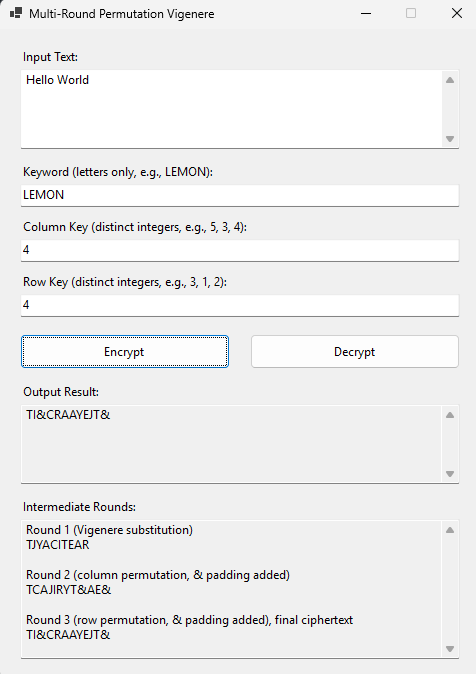
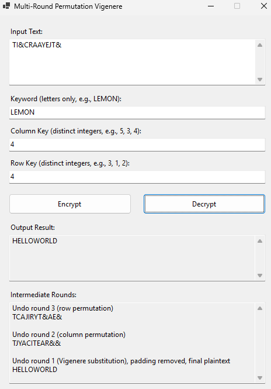
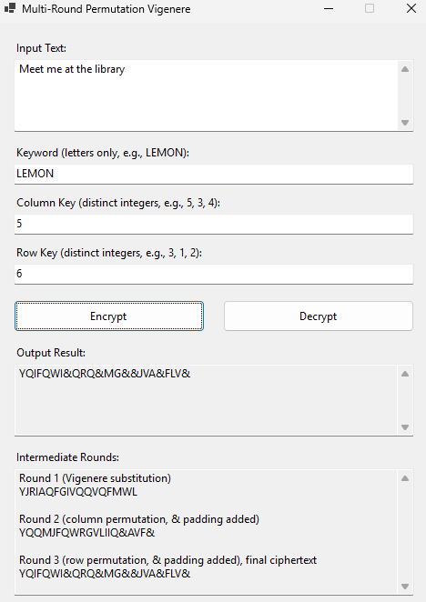
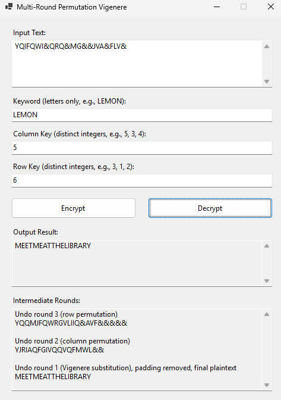
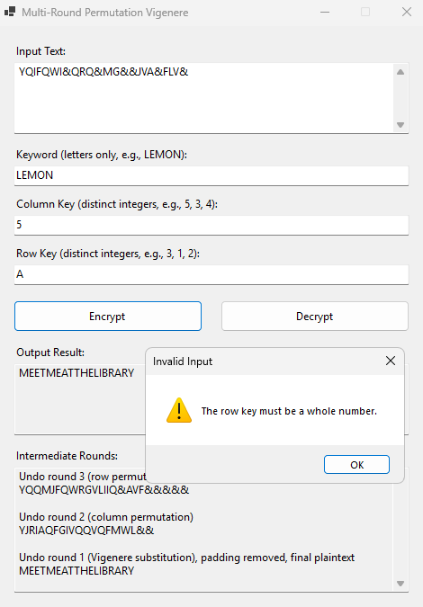

# Multi Round Permutation Vigenère Cipher

CSC 316 Fundamentals of Computer Security, Homework 2

Author: Charbel Estephan 20231222

This is a Windows Forms program written in C# that encrypts and decrypts text with a Vigenère cipher, then scrambles the result with a column permutation round and a row permutation round. Decryption undoes every round in reverse order and returns the original text.

## Features

1. Standard Vigenère substitution with a user chosen keyword.
2. A column permutation round with its own key.
3. A row permutation round with its own key.
4. The three rounds chain together and every round reverses on decryption.
5. An output box with the final result that you can copy and paste straight back into the input box.
6. An "Intermediate Rounds" box that shows the text after every round.
7. Input validation with clear warning messages.

## How to compile and run

You need Windows and the .NET SDK that matches the project (it targets `net10.0-windows`).

Option 1, Visual Studio

1. Open the `.sln` file in Visual Studio.
2. Press F5 to build and run.

Option 2, command line

```
dotnet build
dotnet run
```

If Visual Studio reports that the exe is locked, close the running app and choose Build, then Clean Solution, then Rebuild Solution.

## How to use the program

1. Type or paste your text into **Input Text**.
2. Type a **Keyword** made of letters only, for example `LEMON`.
3. Type a **Column Key**, which is the number of columns in the Round 2 grid, for example `4`.
4. Type a **Row Key**, which is the number of rows in the Round 3 grid, for example `4`.
5. Click **Encrypt** or **Decrypt**.
6. Read the final result in **Output Result**. Read each round in **Intermediate Rounds**.

To test a full cycle, encrypt some text, copy the output into the input box, keep the same three values, and click Decrypt. You get the original text back, in capitals and without spaces.

## The keys

**Keyword.** Letters A to Z only. Each letter becomes a shift where A is 1, B is 2, and so on up to Z at 26. For LEMON the shifts are 12, 5, 13, 15, 14.

**Column Key.** A whole number from 1 to 1000. It is the number of columns in the Round 2 grid.

**Row Key.** A whole number from 1 to 1000. It is the number of rows in the Round 3 grid.

## Text rules

1. The text is converted to capitals and all spaces are removed before encryption.
2. The `&` symbol is used for padding, so the input text cannot contain `&`.
3. Digits and punctuation pass through the substitution unchanged.

## How the rounds work

### Encryption order

```
Plaintext -> Round 1 Substitution -> Round 2 Column permutation -> Round 3 Row permutation -> Ciphertext
```

### Decryption order

```
Ciphertext -> Undo Round 3 -> Undo Round 2 -> Undo Round 1 -> Plaintext
```

### Round 1, Vigenère substitution

Each letter shifts forward by the next keyword letter and wraps around after Z. The keyword repeats when the text is longer. To decrypt, each letter shifts backward by the same amount.

### Round 2, column permutation

1. The text is padded with `&` until it fills a grid with as many columns as the column key.
2. The text is written into the grid row by row.
3. The grid is read column by column.

To reverse it, the program writes the text back column by column and reads the grid row by row.

### Round 3, row permutation

1. The result of Round 2 is padded with `&` until it fills a grid with as many rows as the row key.
2. The text is written into the grid column by column.
3. The grid is read row by row.

To reverse it, the program writes the text back row by row and reads the grid column by column.

### Padding and decryption

Both rounds pad with `&`, so both grids are completely full. The program does not store the text length. During decryption it works out the length from the padding. It tests each possible length for the Round 2 grid and keeps the one where all the `&` characters sit at the end and the last row still holds a real letter. At the end it removes the `&` characters from the plaintext.

## Example test cases

These results come from the same logic the program uses. Always compare them with your own run.

### Example 1

```
Input text   Hello World
Keyword      LEMON
Column key   4
Row key      4
```

Encryption

```
Round 1 (substitution)       TJYACITEAR
Round 2 (column permutation) TCAJIRYT&AE&
Round 3 (row permutation)    TI&CRAAYEJT&
```

The Round 2 grid, with 4 columns

```
T J Y A
C I T E
A R & &
```

The Round 3 grid, with 4 rows, written column by column

```
T I &
C R A
A Y E
J T &
```

Final ciphertext

```
TI&CRAAYEJT&
```

Decryption of `TI&CRAAYEJT&` with the same values

```
Undo round 3   TCAJIRYT&AE&
Undo round 2   TJYACITEAR&&
Undo round 1   HELLOWORLD
```

The original text returns, in capitals and without spaces.





### Example 2, longer text and keys of different sizes

```
Input text   Meet me at the library
Keyword      LEMON
Column key   5
Row key      6
```

Encryption

```
Round 1 (substitution)       YJRIAQFGIVQQVQFMWL
Round 2 (column permutation) YQQMJFQWRGVLIIQ&AVF&
Round 3 (row permutation)    YQIFQWI&QRQ&MG&&JVA&FLV&
```

Final ciphertext

```
YQIFQWI&QRQ&MG&&JVA&FLV&
```

Decryption of `YQIFQWI&QRQ&MG&&JVA&FLV&` with the same values

```
Undo round 3   YQQMJFQWRGVLIIQ&AVF&&&&&
Undo round 2   YJRIAQFGIVQQVQFMWL&&
Undo round 1   MEETMEATTHELIBRARY
```





### Example 3, invalid input

A column key such as `0` or `abc` shows a warning, because the key must be a whole number from 1 to 1000.



## Project structure

```
VigenereCipher/
    Program.cs                 Entry point
    Form1.cs                   Button handlers
    Form1.Designer.cs          Window layout
    VigenereCipher.cs          Cipher logic (VigenereService)
    assets/                    Screenshots of the program running
    README.md                  This file
```

## Notes and limits

1. If the row key equals the number of rows in the Round 2 grid, Round 3 undoes Round 2. For example, Hello World with column key 4 and row key 3 returns only the substitution result plus padding. Pick a different row key for a stronger result.
2. Spaces are removed and letters become capitals, so decryption returns the capitalised text without spaces.
3. A key of 1 leaves that round with nothing to move.
